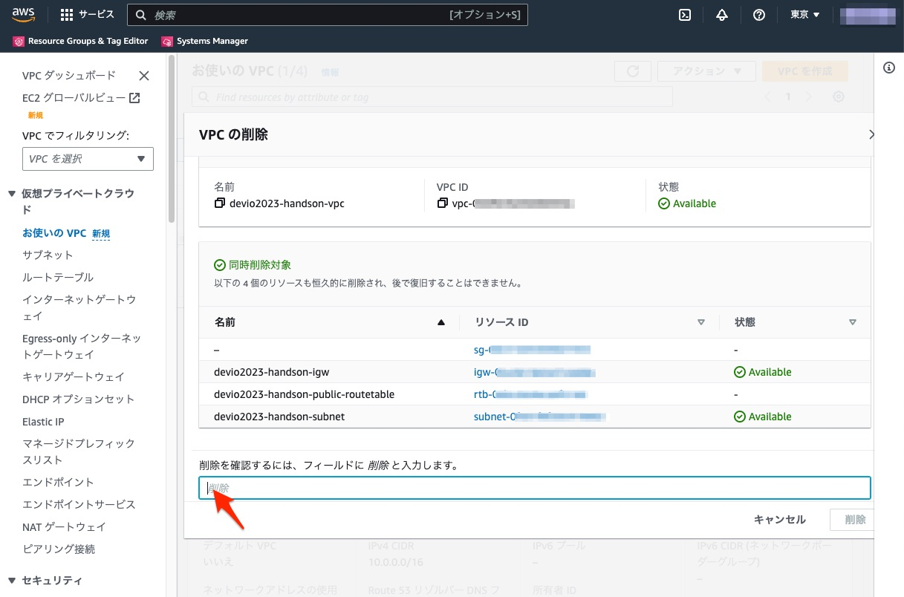

# 初めてのAWS CLI入門（ハンズオン）

このハンズオンは、CLI未経験者にCLIを体験してもらうことを目的としています。

前半は講義形式でCLIについての説明を行い、後半この手順書に沿ってハンズオンを進めていただきます。

講義のプレゼン資料は[こちら](pdf/devio2023-cli-handon.pdf)です。


# CloudShellの準備（ハンズオン準備）

今回のハンズオンはマネージメントコンソールのAWS CloudShellを利用します。
CloudShellにはあらかじめCLI環境がインストールされているので、簡単にCLIを試せます。


## [1] マネージメントコンソールにログイン


## [2] 検索でCloudShellと入力/検索結果のアイコンをクリック


## [3] CloudShellが開きます。これで準備完了。


## [4] 試しに `aws s3 ls` を実行してみましょう。S3のバケット一覧が表示されます。


# ハンズオン手順

ここからは、CloudShellにコマンドを入力しながらハンズオンを進めます。
各手順のコマンドをCloudShellにコピペして、リターンを入力して下さい。

## Step0 環境変数の準備

構築するリソースで利用するパラメーターをあらかじめ環境変数に格納しておきます。

```
export AWS_DEFAULT_REGION='ap-northeast-1'

PROJECT='devio2023-handson'
AZ_CODE="a"
AZ_NAME="${AWS_DEFAULT_REGION}${AZ_CODE}"

VPC_TAG_NAME="${PROJECT}-vpc"
VPC_CIDR='10.0.0.0/16'
SUBNET_TAG_NAME="${PROJECT}-subnet"
SUBNET_CIDR='10.0.0.0/24'
INTERNET_GATEWAY_TAG_NAME="${PROJECT}-igw"
ROUTE_TABLE_TAG_NAME="${PROJECT}-public-routetable"
ROUTE_DESTINATION_CIDR='0.0.0.0/0'
SECURITY_GROUP_NAME="${PROJECT}-sg"
SECURITY_GROUP_DESCRIPTION="${PROJECT} SecurityGroup"

INSTANCE_TAG_NAME="${PROJECT}"
INSTANCE_IMAGE_ID='ami-0f9816f78187c68fb'
INSTANCE_TYPE="t2.micro"
USER_DATA_DIR="${HOME}/environment/${PROJECT}"
USER_DATA_NAME="${PROJECT}-userdata"
```


## Step1 VPC作成

EC2の起動準備として、VPC環境を構築していきます。

[1] タグを変数に格納

今回のハンズオンで作成したリソースを判別するために、Nameタグを準備します。
リソース名はStep0で変数に格納済みですので、それを利用してタグ変数に格納します。
次のStep以降も同様に実施します。

```
VPC_TAG="ResourceType=vpc,Tags=[{Key=Name,Value=${VPC_TAG_NAME}}]" \
  && echo ${VPC_TAG}
```

[2] VPCを作成

CLIコマンドでリソースを作成します。

```
aws ec2 create-vpc \
  --cidr-block ${VPC_CIDR} \
  --tag-specifications ${VPC_TAG}
```

[3] 作成したリソースのIDを変数に格納

次のStep以降で作成したリソースを参照出来るように、リソースIDを変数に格納します。

```
VPC_ID=$( \
  aws ec2 describe-vpcs \
    --filters Name=tag:Name,Values=${VPC_TAG_NAME}  \
    --query 'Vpcs[].VpcId' \
    --output text \
) \
  && echo ${VPC_ID}
```

## Step2 Subnet作成

[1] タグを変数に格納
```
SUBNET_TAG="ResourceType=subnet,Tags=[{Key=Name,Value=${SUBNET_TAG_NAME}}]" \
  && echo ${SUBNET_TAG}
```

[2] Subnetを作成
```
aws ec2 create-subnet \
  --vpc-id ${VPC_ID} \
  --cidr-block ${SUBNET_CIDR} \
  --availability-zone ${AZ_NAME} \
  --tag-specifications ${SUBNET_TAG}
```

[3] 作成したリソースのIDを変数に格納
```
SUBNET_ID=$( \
  aws ec2 describe-subnets \
    --filters Name=vpc-id,Values=${VPC_ID} \
              Name=tag:Name,Values=${SUBNET_TAG_NAME}  \
    --query "Subnets[].SubnetId" \
    --output text \
) \
  && echo ${SUBNET_ID}
```


## Step3 セキュリティグループ作成

[1] セキュリティグループを作成
```
aws ec2 create-security-group \
  --group-name ${SECURITY_GROUP_NAME} \
  --description "${SECURITY_GROUP_DESCRIPTION}" \
  --vpc-id ${VPC_ID}
```

[2] 作成したリソースのIDを変数に格納
```
SECURITY_GROUP_ID=$( \
    aws ec2 describe-security-groups \
    --filter Name=vpc-id,Values=${VPC_ID} \
        Name=group-name,Values=${SECURITY_GROUP_NAME} \
    --query 'SecurityGroups[].GroupId' \
    --output text
) \
  && echo ${SECURITY_GROUP_ID}
```


## Step4 セキュリティグループのインバウンドルールを設定

[1] インバウンドルールを設定
```
aws ec2 authorize-security-group-ingress \
    --group-id ${SECURITY_GROUP_ID} \
    --protocol tcp \
    --port 80 \
    --cidr 0.0.0.0/0
```

## Step5 ルートテーブル作成

[1] タグを変数に格納
```
ROUTE_TABLE_TAG="ResourceType=route-table,Tags=[{Key=Name,Value=${ROUTE_TABLE_TAG_NAME}}]" \
  && echo ${ROUTE_TABLE_TAG}
```

[2] ルートテーブルを作成
```
aws ec2 create-route-table \
  --vpc-id ${VPC_ID} \
  --tag-specifications ${ROUTE_TABLE_TAG}
```

[3] 作成したリソースのIDを変数に格納
```
ROUTE_TABLE_ID=$( \
  aws ec2 describe-route-tables \
    --filters Name=vpc-id,Values=${VPC_ID} \
              Name=tag:Name,Values=${ROUTE_TABLE_TAG_NAME}  \
    --query "RouteTables[].RouteTableId" \
    --output text \
) \
  && echo ${ROUTE_TABLE_ID}
```


## Step6 ルートテーブルをSubnetに関連付け

[1] ルートテーブルの関連付け
```
aws ec2 associate-route-table \
  --subnet-id ${SUBNET_ID} \
  --route-table-id ${ROUTE_TABLE_ID}
```


## Step7 インターネットゲートウェイ作成

[1] タグを変数に格納
```
INTERNET_GATEWAY_TAG="ResourceType=internet-gateway,Tags=[{Key=Name,Value=${INTERNET_GATEWAY_TAG_NAME}}]" \
  && echo ${INTERNET_GATEWAY_TAG}
```

[2] インターネットゲートウェイを作成
```
aws ec2 create-internet-gateway \
  --tag-specifications ${INTERNET_GATEWAY_TAG}
```

[3] 作成したリソースのIDを変数に格納
```
INTERNET_GATEWAY_ID=$( \
  aws ec2 describe-internet-gateways \
    --filters Name=tag:Name,Values=${INTERNET_GATEWAY_TAG_NAME} \
    --query "InternetGateways[].InternetGatewayId" \
    --output text \
) \
  && echo ${INTERNET_GATEWAY_ID}
```


## Step8 インターネットゲートウェイをVPCにアタッチ

[1] VPCにアタッチ
```
aws ec2 attach-internet-gateway \
  --vpc-id ${VPC_ID} \
  --internet-gateway-id ${INTERNET_GATEWAY_ID}
```


## Step9 インターネットゲートウェイ向けルート（パブリックルート）の作成

[1] ルートの作成
```
aws ec2 create-route \
  --route-table-id ${ROUTE_TABLE_ID} \
  --destination-cidr-block ${ROUTE_DESTINATION_CIDR} \
  --gateway-id ${INTERNET_GATEWAY_ID}
```

以上でVPC環境の構築は完了です。

## Step10 EC2インスタンス動作確認用のユーザーデータ作成

動作確認用にWEBサーバーを起動しておきたいと思います。
そこで、起動スクリプトをユーザーデータとして登録します。
CLIでユーザーデータを登録するには、あらかじめローカル環境にスクリプトファイルを準備しておきます。
以下の手順で準備してください。

[1] ローカル環境にディレクトリ作成
```
ls -d ${USER_DATA_DIR} > /dev/null 2>&1 \
  || mkdir -p ${USER_DATA_DIR}
```

[2] ファイルパスを環境変数に格納
```
FILE_USER_DATA="${USER_DATA_DIR}/${USER_DATA_NAME}.bash" \
  && echo ${FILE_USER_DATA}
```

[3] ユーザーデータ作成
```
cat << EOF > ${FILE_USER_DATA}
#!/bin/bash

yum -y update

# setup httpd
yum install -y httpd
systemctl start httpd.service
systemctl enable httpd.service

echo "<html><body>SUCCESS!! DeveloperIO 2023 HANDSON</body></html>" > /var/www/html/index.html
EOF
```

[5] ファイルを確認
```
ls ${FILE_USER_DATA}
```
```
cat ${FILE_USER_DATA}
```


## Step11 EC2 インスタンス起動

[1] タグを変数に格納
```
TAG_KEY='Name'
TAG_CONF_INSTANCE="ResourceType=instance,Tags=[{Key=${TAG_KEY},Value=${INSTANCE_TAG_NAME}}]" \
  && echo ${TAG_CONF_INSTANCE}

```

[2] EC2 インスタンス起動

いよいよEC2インスタンスを起動します。ここまで作成してきたリソースを、パラメーターで指定します。

```
aws ec2 run-instances \
  --image-id ${INSTANCE_IMAGE_ID} \
  --instance-type ${INSTANCE_TYPE} \
  --security-group-ids ${SECURITY_GROUP_ID} \
  --subnet-id ${SUBNET_ID} \
  --tag-specifications ${TAG_CONF_INSTANCE} \
  --user-data file://${FILE_USER_DATA} \
  --associate-public-ip-address
```

## Step12 マネージメントコンソールでリソースを確認する

以上で環境構築は終了です。ここからはマネージメントコンソールで作成したリソースを確認していきます。

### VPCの確認

VPCページの「お使いのVPC」を選択して下さい。
作成したVPCが表示されるはずです。


### EC2の確認

EC2ページの「インスタンス」を選択して下さい。
作成したEC2インスタンスが表示されるはずです。
起動完了まで数分かかります。「2/2のチェックに合格しました」が表示されるまで少しお待ちください。


### インスタンスの動作確認

インスタンスの詳細ページのグローバルIPv4アドレスをコピーします。
そして、ブラウザの新しいタブを開きアドレスバーに `http://グローバルIPv4アドレス` を入力します。
下記のようなページが表示されれば、インスタンスのWEBサーバーの動作確認終了です。


## Step13 作成したリソースをマネージメントコンソールから削除する

最後にハンズオンで作成したリソースを削除します。
今回は時間短縮のため、マネージメントコンソールから削除します。

### EC2の削除

EC2ページの「インスタンス」を選択して下さい。
そして、作成したインスタンスを選択して、インスタンスの終了を実行します。


インスタンスが完全に終了するのを待ちます。


### VPCの削除

インスタンスの終了を確認したら、VPCを削除します。
VPCページの「お使いのVPC」から作成したVPCを選択して、VPCの削除を実行します。


マネージメントから削除する場合は、関連付けられているリソースもまとめて削除されます。
内容を確認して、削除を実行してください。



以上でリソースの削除は終了です。
お疲れ様でした！


# 補足: さらにCLIを学ぶためのリンク集

## AWS 公式ドキュメント

[CLIの公式ドキュメント](https://docs.aws.amazon.com/ja_jp/cli/index.html) に各ドキュメントがまとまっています。特に[コマンドリファレンス](https://awscli.amazonaws.com/v2/documentation/api/latest/reference/index.html)は各CLIコマンドの仕様を確認する際に頻繁に利用しますので、慣れておきましょう。

## JAWS-UG CLI専門支部

JAWS-UGはAWSのユーザがボランティアで運営しているグループです。その中でも[CLI専門支部](https://jawsug-cli.connpass.com/)は、CLIを通じてAWSの理解を深めることを目的に300回以上勉強会が開催されてきました。過去の手順書も公開されていますので、CLIの勉強に活用してください。
CLI専門支部の手順書は、実践で利用出来るように、コマンド実行前の変数確認や、CLIによるハンズオン環境の削除など丁寧まとめられています。業務でCLIを利用する際の参考になると思います。

